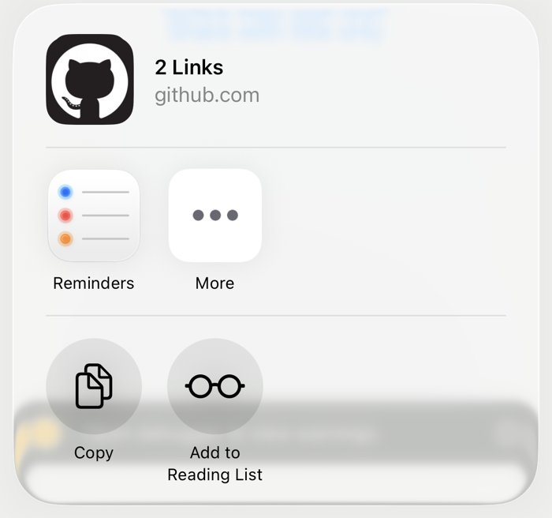
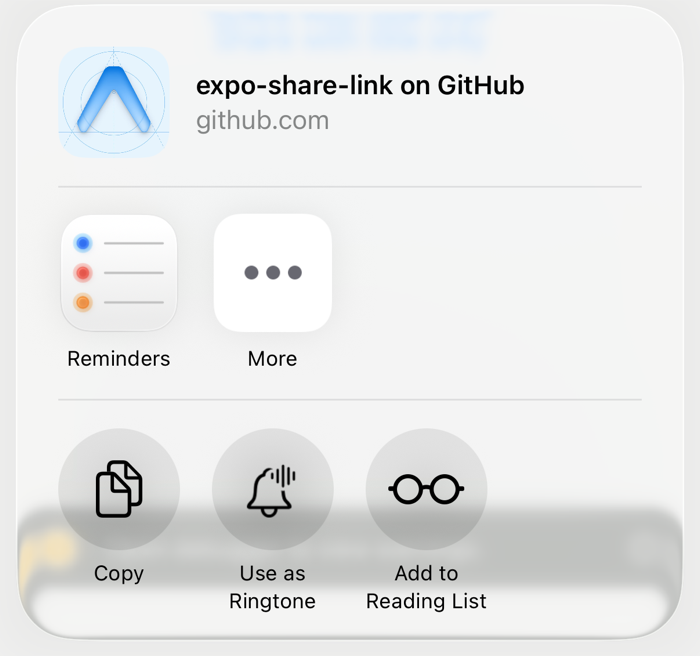

# expo-share-link

Share a link from an Expo app with a **title and icon in the share sheet header**, instead of the generic link placeholder.

[](https://www.npmjs.com/package/expo-share-link)
[](https://github.com/onoja123/expo-share-link/actions/workflows/ci.yml)
[](./LICENSE)

| Before, `Share.share({ message: url, url })`                                              | After, `shareLink({ url, title, icon })`                                                             |
| ----------------------------------------------------------------------------------------- | ---------------------------------------------------------------------------------------------------- |
|  |  |

Both screenshots come from the example app in this repo.

## Why

`Share.share` from React Native hands iOS a plain string. The sheet header reads "Link" or "2 Links" next to a compass icon, with nothing that identifies your app. iOS only draws a custom header when the shared item supplies `LPLinkMetadata`, and that needs native code. Android's sharesheet has the same gap: a preview title and thumbnail need `EXTRA_TITLE` plus a content URI the sheet is allowed to read.

`shareLink({ url, title, icon })` gives you your icon, your title, and the link underneath on both platforms.

This module does both in a few hundred lines, with no config plugin and nothing to configure.

## Install

```sh
npx expo install expo-share-link
```

It's a native module, so it needs a development build or a prebuild. It doesn't work in Expo Go. Expo SDK 52 or newer; the example app and CI run on SDK 54.

```sh
npx expo prebuild
npx expo run:ios   # or run:android
```

## Usage

```ts
import { shareLink } from 'expo-share-link';

await shareLink({
  url: 'https://example.com/book/jane',
  title: 'Book online with Example',
  icon: require('./assets/icon.png'),
});
```

Check `completed` if you want to react to the outcome:

```ts
const { completed, activityType } = await shareLink({ url, title });
if (completed) {
  // activityType is e.g. "com.apple.UIKit.activity.CopyToPasteboard" on iOS
}
```

## API

### `shareLink(options): Promise<ShareLinkResult>`

| Option        | Type                        | Description                                                                                                                          |
| ------------- | --------------------------- | ------------------------------------------------------------------------------------------------------------------------------------ |
| `url`         | `string`                    | The link to share. Required.                                                                                                         |
| `title`       | `string`                    | Shown above the link in the iOS header, as the Android preview title, and passed to the Web Share API.                               |
| `icon`        | `number \| { uri: string }` | A `require()`d image, or a `file://` / `https://` URI. Shown in the iOS header and as the Android preview thumbnail. Ignored on web. |
| `dialogTitle` | `string`                    | Title of the Android chooser dialog. Ignored elsewhere.                                                                              |

Returns `{ completed: boolean; activityType: string | null }`.

Rejects with a `CodedError`:

| Code                         | When                                        |
| ---------------------------- | ------------------------------------------- |
| `ERR_SHARE_LINK_URL`         | `url` is empty or not a valid URL.          |
| `ERR_SHARE_LINK_UNAVAILABLE` | Web only: the browser has no Web Share API. |

### `isAvailable(): boolean`

`true` on iOS and Android. On web, `true` only when `navigator.share` exists.

## Platform behaviour

|                | iOS                                    | Android                                                                | Web                         |
| -------------- | -------------------------------------- | ---------------------------------------------------------------------- | --------------------------- |
| Header title   | Yes, via `LPLinkMetadata.title`        | Yes, via `EXTRA_TITLE` (Android 10+ shows it in the preview)           | Passed to `navigator.share` |
| Header icon    | Yes, via `LPLinkMetadata.iconProvider` | Yes, thumbnail via `ClipData` and a scoped `FileProvider`              | No                          |
| `completed`    | From `completionWithItemsHandler`      | `true` when the chooser reports the chosen app, `false` when dismissed | `false` on cancel           |
| `activityType` | `UIActivity.ActivityType` raw value    | Flattened `ComponentName` of the chosen app                            | `null`                      |

Only the URL is handed to the receiving app. Messaging apps get one link rather than the duplicated text-plus-URL that `Share.share` sends.

## How it works

- **iOS** presents a `UIActivityViewController` with a `UIActivityItemSource` whose `activityViewControllerLinkMetadata` returns `LPLinkMetadata` carrying the URL, the title, and the icon. The icon is loaded off the main thread before the sheet is presented, so the header is complete on its first frame.
- **Android** builds an `ACTION_SEND` intent with `EXTRA_TEXT`, `EXTRA_TITLE`, and `ClipData` pointing at a copy of the icon in the app's cache, exposed through a `FileProvider` with its own authority so it never collides with one your app already declares. A chooser `IntentSender` reports the picked app; the activity result settles a dismissal.
- **Web** calls `navigator.share`.

## Example

```sh
cd example
npm install
npx expo run:ios
```

## Contributing

See [CONTRIBUTING.md](./CONTRIBUTING.md).

## License

[MIT](./LICENSE)
